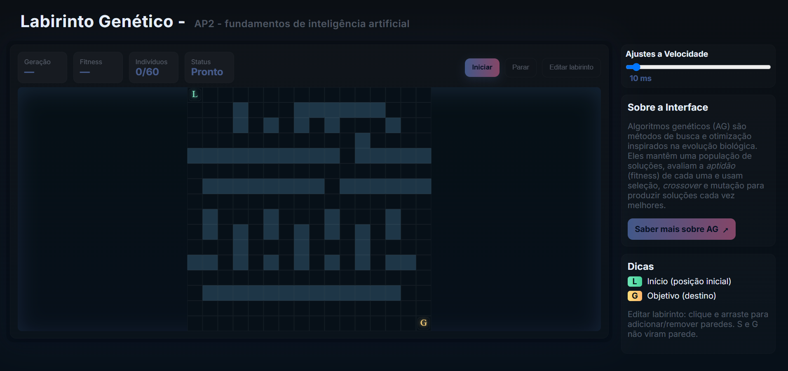

# Algoritmo Genético no Labirinto (ga-ui.js)

Aplicação em JavaScript que usa um Algoritmo Genético (GA) para encontrar um caminho no labirinto 16×16 do ponto L (início) até G (objetivo), com animação passo a passo e controles de velocidade.

---

## Estrutura do projeto

- `index.html` — Estrutura da página e botões de controle.
- `styles.css` — Estilo visual da interface e do canvas.
- `ga-ui.js` — Lógica de renderização, interação e GA (evolução, fitness, animação).
- `README.md` — Documentação sobre o projeto.

---

## Como executar

1. Abra o arquivo `index.html` no navegador (duplo clique) ou sirva com a extensão Live Server do VS Code.
2. Use os controles na tela:
   - “Iniciar”: começa a evolução e a animação por passos.
   - “Parar”: interrompe a execução atual.
   - “Editar labirinto”: alterna o modo de edição para pintar/apagar paredes com o mouse.
3. Ajuste a velocidade no card “Ajustes a Velocidade” (slider de 0 a 200 ms; padrão 10 ms).

Dica: em modo edição, clique e arraste para desenhar/remover paredes. Não é permitido desenhar por cima de L (início) e G (objetivo).

---

## Como funciona (resumo técnico)

- Representação: cada indivíduo é um gene (sequência de passos) com no máximo `MAX_STEPS` movimentos no grid.
- Avaliação (fitness):
  - Simulamos o caminho; se alcançar o objetivo, recebe um grande bônus que privilegia menos passos e menos colisões.
  - Se não alcançar, o fitness usa a distância de grade (BFS) até o objetivo e também a menor distância alcançada ao longo do caminho, penalizando colisões e um leve custo por passo.
  - Essa métrica guiada por BFS dá um gradiente mais informativo do que a distância Manhattan pura em labirintos com paredes.
- Seleção: torneio com pressão seletiva moderada.
- Crossover: ponto único; mutação com pequenas perturbações (e alguns novos passos aleatórios).
- Elitismo: os melhores indivíduos são preservados a cada geração.
- Rastreamento de melhor global: exibimos o melhor fitness já encontrado (monotônico), para percepção clara de progresso.

---

## Controles e HUD

- Botões principais:
  - Iniciar — começa a evolução do GA e a animação por passos na geração atual.
  - Parar — interrompe; limpa a animação e reseta o estado para próxima execução.
  - Editar labirinto — alterna modo de pintura de paredes (não modifica L e G).
- Ajustes de velocidade:
  - Slider 0–200 ms; valor menor = mais rápido. Padrão inicial: 10 ms.
- HUD:
  - Geração — número da geração atual.
  - Fitness — melhor global (melhor de todas as gerações até agora).
  - Indivíduos — quantidade exibida vs. população total.
  - Status — indica execução, edição, passo atual e mensagens de erro/alerta.

---

## Imagem exemplo

    

